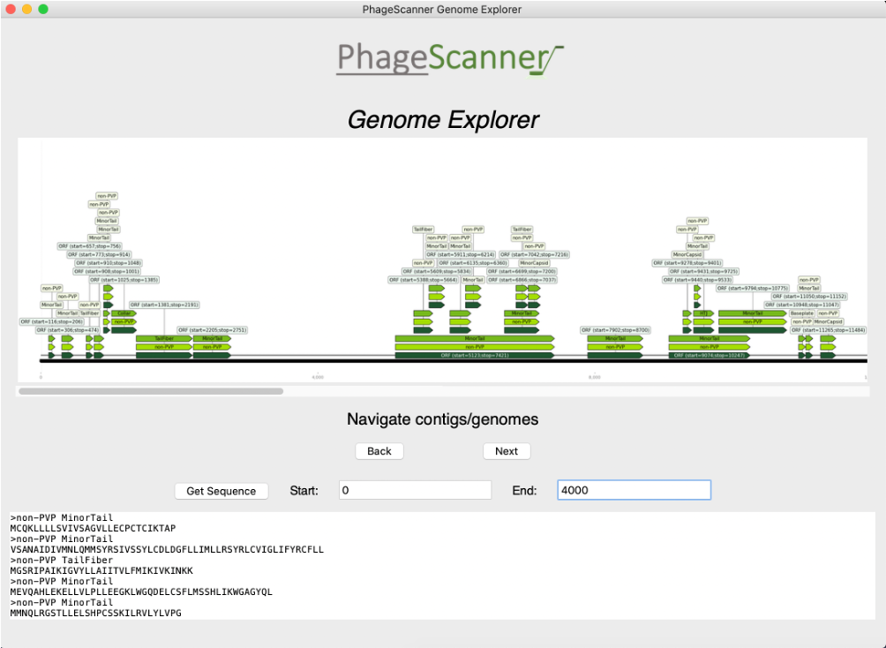

<p align="center">
<a href="https://github.com/Dreycey/PhageScanner/actions/"></a>
<a href="https://github.com/Dreycey/PhageScanner/blob/master/LICENSE.txt"></a>
<a href="https://github.com/psf/black"></a>
<a href="https://github.com/Dreycey/PhageScanner/blob/dreycey/master/reports/interrogate.out"></a>
</p>


# PhageScanner

PhageScanner is a command line tool for identifying phage virion proteins (PVPs) using sequencing data as input.

Subscribe to email list:
Unsubscribe from email list: 

## Installation

To setup the conda environment, use the following command once conda is installed locally.

```
conda env create -f environment.yml;
```

It can now activated using:
```
conda activate phagescanner
```

## Pipeline Usage
PhageScanner is a command line tool and machine learning pipeline for automating the process of finding genes of interest. In particular, it is useful for unifying the efforts of identifying Phage Virion Proteins, and can speed up the process of finding models and using them on metagenomic data, genomes and proteins.

1. Build the database

    - Basic usage
    ```
    python phagescanner.py database -c Path/To/Config.yaml -o path/to/output/directory/ -n name_for_files_<classname>
    ```
    - Example (multiclass pvps)
    ```
    python phagescanner.py database -c configs/multiclass_pvps/database_multiclass.yaml -o ./benchmarking_database/ -n benchmarking -v info

    ```
    - Example (binary pvps)
    ```
    python phagescanner.py database -c configs/binary_pvps/database_binary.yaml -o ./binary_database/ -n benchmarking -v info
    ```
    - Example (toxin proteins)
    ```
    python phagescanner.py database -c configs/phage_toxins/database_toxins.yaml -o ./toxin_database/ -n benchmarking -v info
    ```
2. Training and Test ML models
    - Basic usage
    ```
    python phagescanner.py train -c Path/To/Config.yaml -o path/to/output/directory/ -n name_for_files_<classname> -v debug
    ```
    - Example (multiclass pvps)
    ```
    python phagescanner.py train -c configs/multiclass_pvps/training_multiclass.yaml -o training_output -n TRAIN -v debug
    ```
    - Example (binary pvps)
    ```
    python phagescanner.py train -c configs/binary_pvps/training_binary.yaml -o binary_training_output -n TRAIN -v debug
    ```
    - Example (toxin proteins)
    ```
    python phagescanner.py train -c configs/phage_toxins/training_toxins.yaml -o phagetoxin_training -n TRAIN -v debug
    ```
    - Example (testing different features using baseline, logistic regression model)
    ```
    python phagescanner.py train -c configs/multiclass_pvps/feature_testing.yaml -o feature_testing -n TRAIN -v debug
    ```
3. Run on metagenomic data, genomes or proteins
    - Basic usage
    ```
    python phagescanner.py predict -c Path/To/Config.yaml -o path/to/output/directory/ -t ("reads", "genome", or "protein") -n name_for_files_<classname> -i <input file> -v debug
    ```
    - Example (genomes)
    ```
    python phagescanner.py predict -c configs/prediction.yaml -t "genome" -o prediction_output -n "genomes" -i examples/GCF_000912975.1_ViralProj227117_genomic.fna -v debug
    ```
    - Example (reads)
    ```
    python phagescanner.py predict -c configs/prediction.yaml -t "reads" -o prediction_output -n "OUTPREFIX" -i examples/test_c100000_n10_e0.0.fq -v debug
    ```
    - Example (proteins)
    ```
    python phagescanner.py predict -c configs/prediction.yaml -t "protein" -o prediction_output -n OUTPREFIX -i examples/Phage_Collar_proteins.fa -v debug
    ```

# PhageScanner GUI

PhageScanner has a GUI for viewing the results of the prediction pipeline to allow for scraping proteins of interest. This GUI is a visual tool for viewing the results of the prediction pipeline. The benefit of this GUI is that it allows for vissually mining proteins that may be interesting for further analysis, or for observing where the proteins appear within a genome or contig (along with synteny).



## Usage

1. Create images from the output of running the `predict` pipeline.
    - run the `predict` pipeline on genomes or reads
    ```
    python phagescanner.py predict -c configs/prediction.yaml -t "genome" -o prediction_output -n "genomes" -i examples/GCF_000912975.1_ViralProj227117_genomic.fna -v debug
    ```
    - use output from the `predict` pipeline to create images
    ```
    python phagescanner_gui.py create_images -p prediction_output/genomes_predictions.csv -o output_images/
    ```
2. Open the GUI using the path to the prediction output and the images path.
    - Open the GUI
    ```
    python phagescanner_gui.py gui -p prediction_output/genomes_predictions.csv -o output_i
mages/
    ```

# Notes

1. Database configuration names must match those in in the `DatabaseAdapterNames` Enum. If you want to create a new database adapter, make sure to add the name to the `DatabaseAdapterNames` enum. In addition, you must ensure these names match the configuration file, or the database query will be ignored.
2. Each "pipeline", as specified in the `Pipelines.py` file, is tied to a specific configuration class that is directly coupled with a particular configuration file. If you want to change the names for a particular pipeline, you must update the corresponding class. This design pattern allows for easily changing the configuration dependencies for a particular pipeline.
3. Make sure the configuration files have names that are one word - without spaces.
